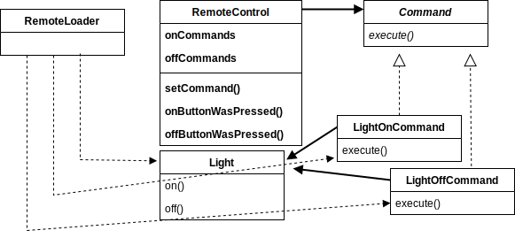

# The Command Pattern
The Command Pattern encapsulates a request as an object, thereby letting you parameterize clients with different requests, queue or log requests, and support undoable operations.

When you need to decouple an object making requests from the objects that know how to perform the requests, use the Command Pattern.

* The Command Pattern allows us to encapsulate methods into Command objects: store them, pass them around, and invoke them when you need them. 

* The Command Pattern supports the decoupling of the invoker of a request and the receiver of the request.

* A Command object is at the center of this decoupling and encapsulates a receiver with an action or set of actions.

* From the outside, no other objects really know what actions get performed on what receiver; they just know that if they call the `execute()` method, their request will be serviced.

## Example scenario 
We design a remote control by many vendor classes whose methods have all different method names and behaviors.
We expect more vendor classes in the future with just as diverse methods.

It is important we view this as a separation of concerns: the remote should know how to interpret button presses and make requests, but it should not know a lot about home automation or how to operate a device.
Also, we do not want the remote to have to know the specifics of the vendor classes.
Otherwise, whenever a new vendor class comes out, we’d have to go in and modify the code, potentially creating bugs and more work for ourselves.

## Approaches
* As a model for an OO design pattern that allows us to separate an object making a request from the objects that receive and execute those requests.

* The Command Pattern allows you to decouple the requester of an action from the object that actually performs the action. 
So, the requester would be the remote control and the object that performs the action would be an instance of one of your vendor classes.

* You can do that by introducing “command objects” into your design.
A command object encapsulates a request to do something like turning on a light on a specific object such as the living room light object. 
So, if we store a command object for each button, when the button is pressed we ask the command object to do some work. 
The remote does not have any idea what the work is, it just has a command object that knows how to talk to the right object to get the work done.
Therefore, the remote is decoupled from the light object!

* The remote does not know anything but how to call `execute()` on the corresponding command object when a button is pressed.

* The receiver of the request gets bound to the command it’s encapsulated in.

* The design produces a remote that is easy to maintain and going to have no trouble convincing the vendors to write some simple command classes in the future since they are so easy to write. 

## Diagram

This is a simple overview of the example structure.

## References
* Head First Design Patterns