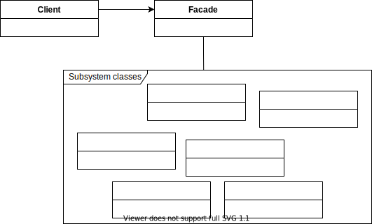

# The Facade Pattern
**The Facade Pattern provides a unified interface to a set of interfaces in a subsystem. 
Facade defines a higher-level interface that makes the subsystem easier to use.**

The intent of the Facade Pattern is to provide a simplified interface to a subsystem.

* The Facade Pattern simplifies and unifies a large interface or complex set of interfaces.

* The Facade Pattern allows us to avoid tight coupling between clients and complex subsystems,
 and helps us adhere to the principle of Least Knowledge.

* The Facade Pattern still exposes the full functionality of the system to those who may need it.

* The Facade Pattern allows for any number of facades to be created for a given subsystem.


## Design Principle
### The principle of Least Knowledge
**Talk only to your immediate friends.**

* The principle guides us to reduce the interactions between objects to just a few close friends.
* When you design a system, for any object, be careful of the number of classes it interacts with and also how it comes to interact with those classes.
* This principle prevents us from creating designs that have a large number of classes coupled together so that changes in one part of the system cascade to other parts.
  - Dependencies between many classes: a fragile system that is costly to maintain and complex to understand.

#### Guidelines
(From any method in any object) We should only invoke methods that belong to:
- The object itself
- Objects passed in as a parameter to the method
- Any object the method creates or instantiates
- Any components of the object
  - "Component" as a HAS-A relationship: any object that is referenced by an instance variable.

In other words, NOT to call methods on objects that were returned from calling other methods.

For example, a bad example is that we get the thermometer object from the station and call the `getTemperature()` method ourselves.
```java
class Test{
    Station station;
    // bad example
    public float getTemp() {
        Thermometer thermometer = station.getThermometer();
        return thermometer.getTemperature();
    }
}
```

With the principle, we add a method to the Station class that makes the request to the thermometer for us.
Therefore, we can reduce the number of classes it depends on, and we don't have to know about its component objects.
```java
class Test{
    Station station;
    // with the principle
    public float getTemp() {
        return station.getTemperature();
    }
}
```

However, note that applying this principle results in more "wrapper" classes being written to handle method calls to other components. 
This can result in increased complexity and development time as well as decreased runtime performance.


## Diagram



## References
* Head First Design Patterns